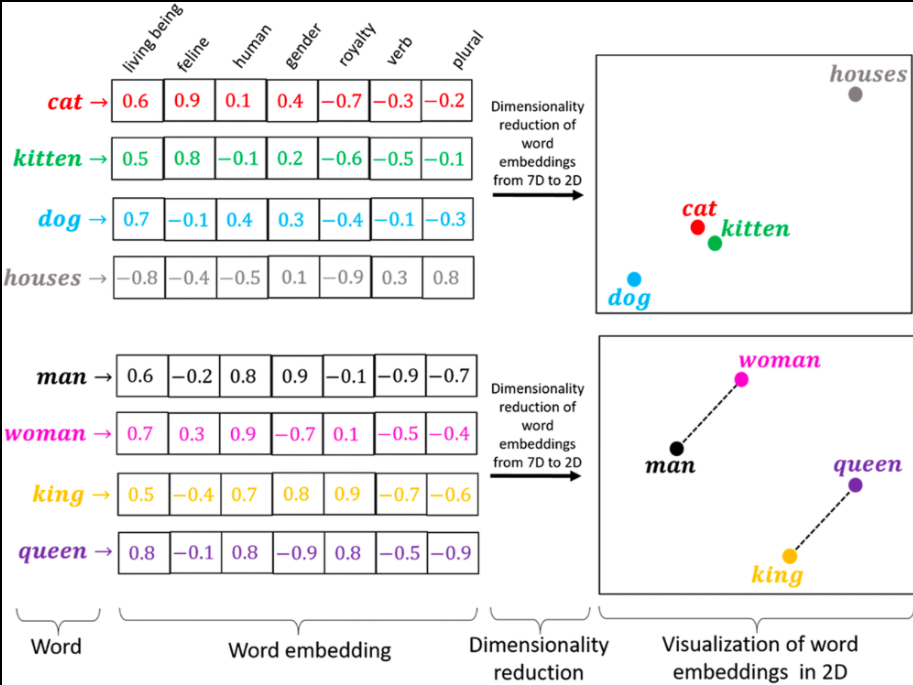

u[What are Embeddings (simple intuition)
An embedding converts raw data (text / image / audio / code) into a vector of numbers that represents meaning.
Example:

An embedding model is a neural network:
Input (text/image)
↓
Transformer / Encoder
↓
Dense vector (embedding)

# ⭐ Popular Embedding Models (Production Reality)

Let’s cover the main ones.

## 🔹 OpenAI – text-embedding-3-large / small

### Characteristics

Dimensions: 3072 (large), 1536 (small)
Extremely strong semantic quality
Multilingual
Excellent for RAG
Used heavily in production.

### Why popular?

✅ high accuracy✅ strong reasoning alignment❌ paid API

## 🔹 SentenceTransformers (SBERT family)

Examples:
all-MiniLM-L6-v2
mpnet-base-v2
Built on Hugging Face.

### Characteristics

384–768 dims
open-source
fast
local inference
Great for:
✔ on-prem✔ privacy✔ experimentation

## 🔹 BAAI – BGE Models

Examples:
bge-small
bge-base
bge-large
Very popular in modern RAG.

### Strength

optimized for retrieval
supports query/document prefixes
strong open-source alternative to OpenAI

## 🔹 Google – Universal Sentence Encoder

Older but foundational.
Used for:
semantic similarity
clustering
search

## 🔹 Cohere – embed-v3

Commercial embeddings optimized for enterprise search.

Important
Different embedding models produce different vector sizes because dimension is a deliberate architectural + training choice that trades off accuracy, speed, memory, and cost.
the count of numbers is the dimension.
Examples:
- 384 numbers → 384-D embedding
- 768 numbers → 768-D embedding
- 1536 numbers → 1536-D embedding
- 3072 numbers → 3072-D embedding
Each dimension represents a learned semantic feature.
Most embedding models use transformer encoders.
The hidden size of the transformer often becomes the embedding size.
Examples:
- MiniLM → 384
- MPNet → 768
- Larger transformers → 1024+
So dimension directly follows network width.
For example:
SentenceTransformers models often use 384–768 dims for speed.
OpenAI embeddings use 1536–3072 dims to maximize semantic fidelity.
BAAI BGE-large uses higher dims for retrieval quality.

## 4️⃣ Production constraints

Vendors care about:
vector DB storage
retrieval latency
RAM usage
bandwidth
Embedding size affects everything:

### Example

1 million vectors:
384 dims → ~1.5GB
1536 dims → ~6GB
3072 dims → ~12GB
So dimension = infrastructure cost.
A well-trained 384-D model can beat a poorly trained 3000-D model.

### Use 384–768 when:

local deployment
fast prototyping
limited RAM
small datasets

### Use 1024–3072 when:

production RAG
large knowledge bases
complex documents
high answer quality needed
But remember:
