### Langchain components:🚀

Here are the key components of LangChain:

1️⃣ Models (LLMs & Chat Models)
- Interfaces for interacting with LLMs (GPT, DeepSeek, Claude, etc.).
- Supports Chat Models for structured conversations.

2️⃣ Prompts 🎭
- Helps structure inputs for better AI responses.
- Includes prompt templates & dynamic variable injection.

3️⃣ Memory 🧠
- Allows AI to remember past interactions.
- Supports short-term & long-term memory for chatbots.

4️⃣ Indexes 📂
- Stores & retrieves large text data efficiently.
- Used for vector search (FAISS, ChromaDB, Pinecone, etc.).

- Output Parser:
- Output parser is responsible for taking the output of a model and transforming it to a more suitable format for downstream tasks. Useful when you are using LLMs to generate structured data, or to normalize output from chat models and LLMs.

- LangChain has lots of different types of output parsers. This is a list of output parsers LangChain supports.

5️⃣ Chains 🔗
- Connects multiple components (LLMs, Memory, Prompts) in a workflow.
- Supports sequential & agent-based chaining.

6️⃣ Agents 🤖
- Uses LLMs to make decisions dynamically.
- Can interact with APIs, databases, & tools (e.g., Google Search).

7️⃣ Tools 🛠️
- Extends AI’s functionality (e.g., search engines, code execution, APIs).
- Includes Python REPL, WolframAlpha, SERP API, etc.

8️⃣ Callbacks 📡
- Monitors and logs AI interactions in real-time.
- Useful for debugging & tracking responses.

9️⃣ Runnable & Executors ⚡
- Optimizes & parallelizes workflows for faster execution.
- Helps in batch processing and streaming responses.

🔹 Summary
LangChain provides a modular framework for building AI-powered applications like chatbots, RAG systems, and intelligent assistants. 🚀

## Explaination of each component

LangChain primarily provides two types of models:

Language models in LangChain come in two flavors:

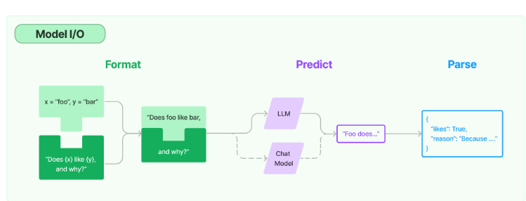

1️⃣ LLMs (Large Language Models)

The APIs they wrap take a string prompt as input and output a string completion. OpenAI's GPT-3 is implemented as an LLM.Additionally, not all models are the same. Different models have different prompting strategies that work best for them. For example, Anthropic's models work best with XML while OpenAI's work best with JSON. You should keep this in mind when designing your apps.
- Used for single-turn text generation (not conversational).
- Typically takes a single text input and returns a text output.
- Examples:
- OpenAI GPT models (text-davinci-003)
- Google Gemini (text-based)
- Hugging Face text-generation models
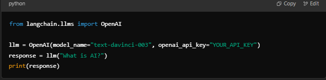

2 Chat Models (Conversational Models)
Chat models are often backed by LLMs but tuned specifically for having conversations.
Instead of a single string as llms, they take a list of chat messages as input and they return an AI message as output
- Designed for multi-turn interactions (e.g., chatbot-like conversations).
- Works with structured messages like system, user, and assistant roles.
- Examples:
- OpenAI GPT (gpt-4, gpt-3.5-turbo)
- Claude (Anthropic)
- Groq (llama-3-70b)
- DeepSeek
- 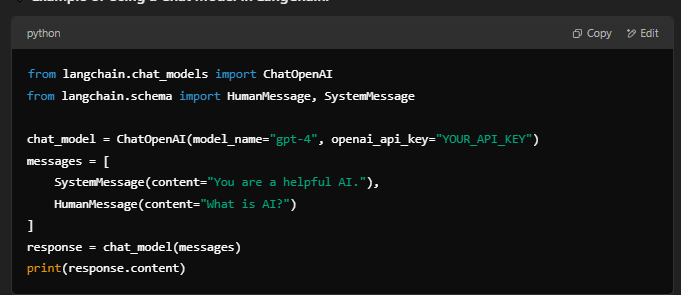
- The main difference between them is their input and output schemas. The LLM objects take string as input and output string. The ChatModel objects take a list of messages as input and output a message.
- Most important
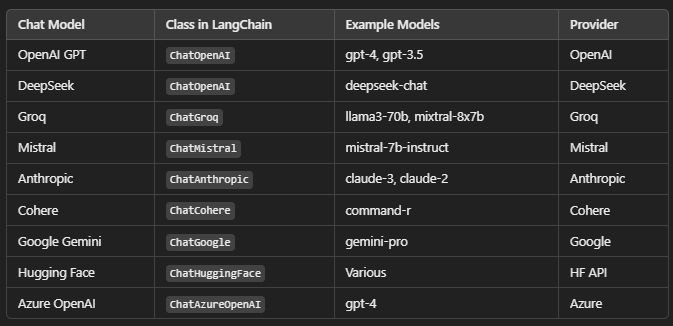

### Prompts

A prompt for a language model is a set of instructions or input provided by a user to guide the model's response, helping it understand the context and generate relevant and coherent language-based output, such as answering questions, completing sentences, or engaging in a conversation.

Prompts templetes
Prompt templates are predefined recipes for generating prompts for language models.
A template may include instructions, few-shot examples, and specific context and questions appropriate for a given task.
LangChain strives to create model agnostic templates to make it easy to reuse existing templates across different language models.

Notes: langchain_core contains only the essential components, making it faster and lighter.

Types :
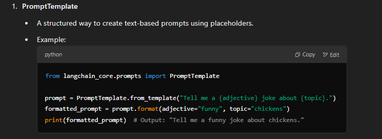

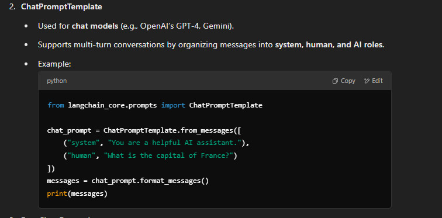

## 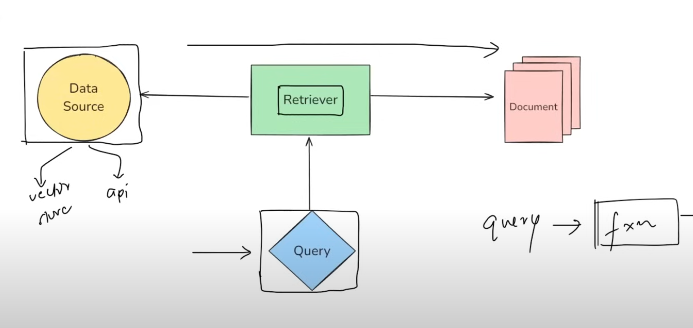

RETRIEVERS 

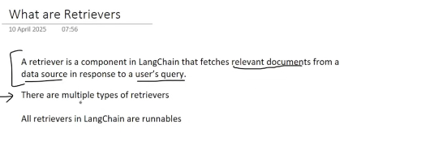

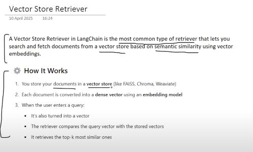

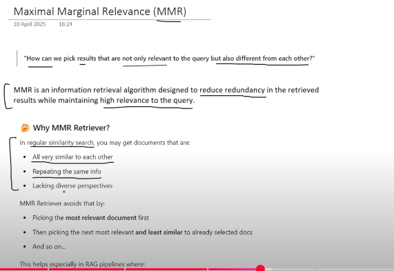

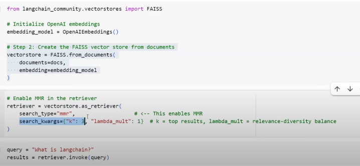

What is a Document in LangChain?
A Document in LangChain is essentially a text + metadata object. It helps preserve both the content and context of data for use in applications like RAG (Retrieval-Augmented Generation), chatbots, or semantic search.
LangChain’s Document is more than just a string — it’s a structured representation of knowledge with context, which is vital for accurate retrieval, traceability, and filtering in modern AI applications.

